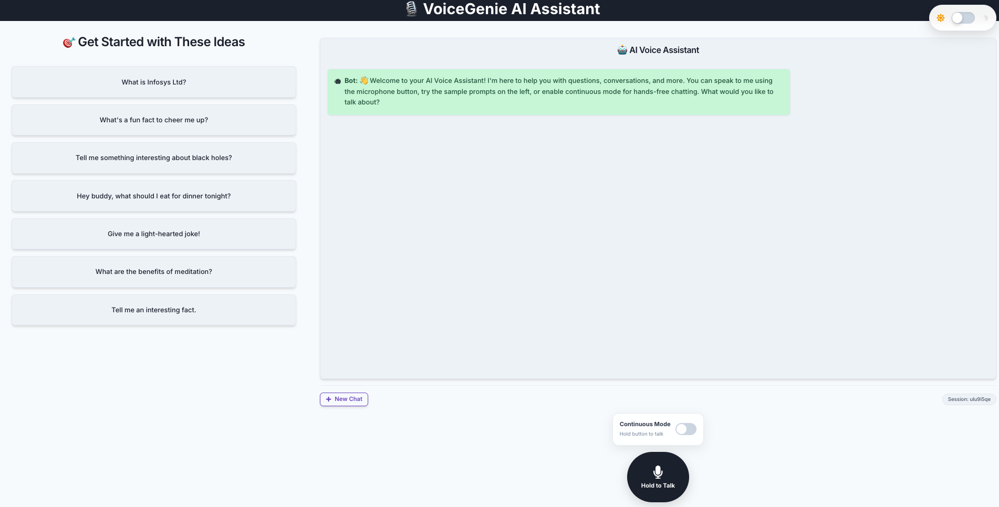
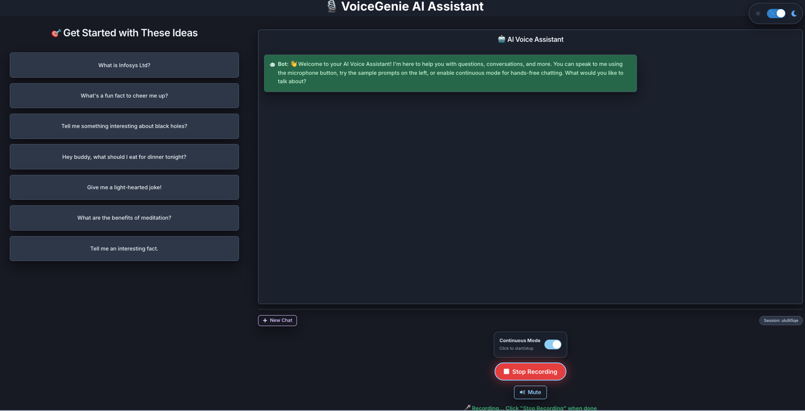

# Audio Voice Chatbot

## Overview

An AI-powered voice chatbot that enables natural conversation through speech recognition and text-to-speech capabilities. The system features a modern React frontend with voice controls and a FastAPI backend for extensible AI model integration.

---

## Technologies Used

- **Frontend:** React 18 + Vite + Chakra UI
- **Backend:** Python FastAPI with OpenRouter/Llama-3 integration
- **AI Engine:** OpenRouter Llama-3-8b-instruct (backend)
- **Speech:** Web Speech API + react-speech-recognition
- **Styling:** Chakra UI with responsive design and dark mode
- **Development:** Hot reload, modern ES modules

---

## Key Features

### Voice Interaction
- **Speech Recognition:** Real-time voice input using browser's speech recognition
- **Text-to-Speech:** AI responses spoken aloud with mute/unmute controls
- **Voice Modes:** Push-to-talk and continuous recording modes
- **Voice Controls:** Start/stop listening, generate responses from speech

### Chat Interface
- **Conversation History:** Persistent chat history with user/bot message distinction
- **Sample Prompts:** Pre-defined questions for quick interaction
- **Responsive Design:** Works seamlessly on desktop and mobile devices
- **Modern UI:** Clean, intuitive interface with smooth dark/light mode transitions
- **Dark Mode:** Ultra-smooth animated dark mode toggle with themed components

### AI Integration
- **Backend Integration:** FastAPI backend with OpenRouter Llama-3-8b-instruct
- **Session Management:** Maintains conversation context across interactions
- **Conversation Context:** Contextual responses based on chat history

---
## Application snapshots



---

## Local Testing Guide

### Prerequisites

- **Node.js** (v18 or higher)
- **Python** (v3.8 or higher)
- **API Keys:**
  - OpenRouter API key for backend

### Environment Setup

1. **Clone the repository:**
   ```bash
   git clone https://github.com/bhushankorg/audio-chatbot.git
   cd audio-chatbot
   ```

2. **Create environment files:**

   **Backend (.env in project root):**
   ```env
   API_KEY=your_openrouter_api_key_here
   VITE_BACKEND_URL=http://localhost:8000
   ```

### Quick Start with Startup Scripts

We provide convenient startup scripts to streamline the development process:

#### Option 1: Individual Scripts

**Start Backend:**
```bash
# Make script executable
chmod +x scripts/start-backend.sh
./scripts/start-backend.sh
```

**Start Frontend:**
```bash
# Make script executable  
chmod +x scripts/start-frontend.sh
./scripts/start-frontend.sh
```

#### Option 2: Start Both Services
```bash
# Start both frontend and backend concurrently
chmod +x scripts/start-all.sh
./scripts/start-all.sh
```

### Manual Setup (if you prefer step-by-step)

#### Frontend Setup

1. **Navigate to frontend directory:**
   ```bash
   cd frontend
   ```

2. **Install dependencies:**
   ```bash
   npm install
   ```

3. **Start development server:**
   ```bash
   npm run dev
   ```

4. **Access the application:**
   - Open browser to `http://localhost:5173`
   - Allow microphone permissions when prompted

#### Backend Setup

1. **Navigate to backend directory:**
   ```bash
   cd backend
   ```

2. **Create virtual environment:**
   ```bash
   python -m venv venv
   source venv/bin/activate  # On Windows: venv\Scripts\activate
   ```

3. **Install dependencies:**
   ```bash
   pip install -r requirements.txt
   ```

4. **Start the backend server:**
   ```bash
   uvicorn main:app --reload
   ```

5. **Test the backend:**
   - Backend runs on `http://localhost:8000`
   - API documentation available at `http://localhost:8000/docs`

### Testing the Voice Features

1. **Speech Recognition:**
   - **Push-to-Talk Mode:** Hold the microphone button while speaking
   - **Continuous Mode:** Toggle switch, then click start/stop recording
   - Speak clearly into your microphone

2. **Text-to-Speech:**
   - AI responses are automatically spoken
   - Use the mute/unmute button to control audio output
   - **Stop Speaking button appears when chatbot is talking**
   - Individual message playback available in chat history

3. **Dark Mode:**
   - Click the beautiful animated toggle in the top-right corner
   - Enjoy ultra-smooth transitions and themed components

4. **Sample Prompts:**
   - Click any prompt card on the left to quickly test AI responses
   - Prompts cover various topics for comprehensive testing

### Browser Compatibility

- **Recommended:** Chrome, Edge, Safari (latest versions)
- **Speech Recognition:** Requires HTTPS in production (works on localhost for development)
- **Microphone Access:** Browser will request permissions on first use

---

## Project Structure

```
audio-chatbot/
├── frontend/                 # React + Vite frontend
│   ├── src/
│   │   ├── components/
│   │   │   ├── ChatBox.jsx  # Main chat interface with voice controls
│   │   │   └── ChatWindow.jsx
│   │   ├── App.jsx          # Main app component
│   │   └── main.jsx         # Entry point
│   ├── package.json
│   └── vite.config.js
├── backend/                  # FastAPI backend
│   ├── main.py              # FastAPI app entry point
│   ├── routes.py            # API routes
│   ├── llm_service.py       # OpenRouter integration
│   ├── config.py            # Configuration
│   ├── requirements.txt     # Python dependencies
│   └── start_backend.sh     # Backend startup script
├── scripts/                  # Startup scripts
│   ├── start-backend.sh     # Start backend only
│   ├── start-frontend.sh    # Start frontend only
│   └── start-all.sh         # Start both services
└── README.md                # This file
```

---

## Troubleshooting

### Common Issues

1. **Microphone not working:**
   - Ensure browser has microphone permissions
   - Check if other applications are using the microphone
   - Try refreshing the page and granting permissions again

2. **Speech recognition not responding:**
   - Speech recognition works best in Chrome/Edge
   - Ensure you're speaking clearly and loudly enough
   - Check browser console for any errors

3. **Backend connection issues:**
   - Verify the backend is running on port 8000
   - Check that CORS is properly configured
   - Ensure API keys are correctly set in environment files

4. **API key errors:**
   - Verify your OpenRouter API key is valid and has quota
   - Check API key format and permissions
   - Ensure environment file is in the correct location

### Development Notes

- **Current Architecture:** Frontend connects to FastAPI backend for AI processing
- **Voice Processing:** Speech recognition and text-to-speech handled by frontend
- **Session Management:** Backend maintains conversation context
- **Dark Mode:** Fully animated with smooth transitions and themed components

---

## Deployment Overview (AWS EC2)

1. **Launch EC2 instance (Ubuntu).**
2. **Install Python, Node.js, and dependencies.**
3. **Run backend using Gunicorn.**
4. **Build and serve frontend.**
5. **Set up Nginx as a reverse proxy.**
6. **Add SSL via Certbot (Let's Encrypt).**
7. **Access chatbot via your public domain or EC2 IP.**

---

## Summary

This project combines AI, voice technology, and modern web development to create an accessible, intelligent, and scalable voice chatbot system. The modular architecture supports easy integration of different AI models, beautiful UI with dark mode, and comprehensive voice interaction capabilities.
